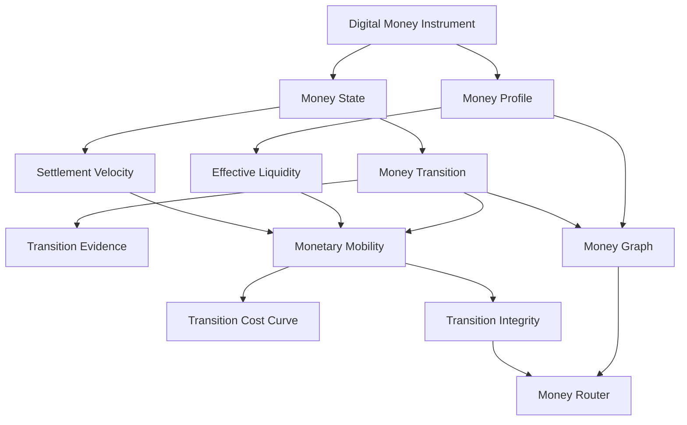

# OMST — Open Monetary State & Transition Standard

Portable settlement compatibility and verification for heterogeneous digital-money systems.

OMST defines what a settlement requires, describes what a form of digital money can currently provide, attaches evidence, evaluates compatibility, and gives another implementation enough information to independently verify the result.

[Specification](SPECIFICATION.md) [Whitepaper](WHITEPAPER.md) [Schemas](schemas/) [Python](src/omst/) [Explorer](web/) [Conformance](conformance/)

Digital money is becoming programmable, tokenised and fragmented. Same currency denomination does not necessarily imply settlement equivalence.

The same currency denomination can exist across:

- central-bank settlement systems
- tokenised deposits
- regulated digital money
- public blockchains
- permissioned DLT networks

But these instruments do not necessarily have the same operational properties.

OMST provides open machine-readable primitives for:

- monetary functions
- monetary states
- monetary transitions
- transition evidence
- settlement velocity
- effective liquidity
- monetary mobility
- transition integrity
- settlement-compatibility profiles
- settlement, participant and interoperability profiles
- settlement request, offer and response exchange
- adapter mappings for external standards
- portable settlement evaluation packages
- independent verification records
- requirement sets
- conformance vectors

OMST does not issue, custody or settle money.

It describes how digital money behaves and changes state.

## The Problem

EUR 1 is not always operationally equivalent to EUR 1.

Digital-money instruments can differ in settlement finality, liquidity, redemption, availability, interoperability, access, transferability and operating windows. OMST makes these differences explicit and machine-readable.

## Positioning

OMST is open infrastructure for tokenised monetary systems. It is not a stablecoin, reserve system, proof-of-reserves platform, bridge, payment app, blockchain, token, DAO or compliance product.

The central research question is:

> When digital money moves between monetary instruments, ledgers or settlement environments, what properties are preserved, degraded or transformed?

## Install

```bash
pip install -e .
```

## Explorer

OMST Explorer is a synthetic-data web workbench for monetary state, settlement compatibility, profile exchange, adapters, routing, stress scenarios, conformance status and portable verification. The v0.7 scenario compares EUR-X, EUR-Y and EUR-Z against the same EUR 50m tokenized-bond DvP requirements:

- `EUR-X`: `COMPATIBLE`
- `EUR-Y`: `CONDITIONALLY_COMPATIBLE` because mandatory requirements pass but liquidity evidence is stale
- `EUR-Z`: `INCOMPATIBLE` because mandatory atomicity, finality, availability, latency and liquidity requirements fail

```bash
npm install
npm run web:build
npm run ts:check
npm run web:test
npm run web:dev
```

The Explorer is not issuer evidence, regulatory evidence, market-condition evidence or production compliance tooling.

## CLI

```bash
omst validate examples/
omst validate conformance/vectors/
omst requirement examples/requirements/tokenized-bond-dvp.json
omst inspect examples/synthetic-eur-stablecoin/eur-x.json
omst profile examples/eur-x.json
omst state EUR-X
omst capability EUR-X
omst transition --from EUR-X:AVAILABLE --to EUR-Y:FINAL --amount 50000000
omst equivalence EUR-X EUR-Z --context tokenized-dvp
omst velocity EUR-X --window 30d
omst liquidity EUR-X
omst mobility --from EUR-X --to EUR-Y --amount 50000000
omst route --from EUR-X --to EUR-Y --amount 50000000 --context tokenized-dvp
omst evaluate-settlement examples/tokenized-bond-dvp/settlement-intent.json --money examples/eur-x.json
omst evaluate-settlement examples/tokenized-bond-dvp/settlement-intent.json --money examples/eur-x.json --settlement examples/settlement-networks/network-a.json
omst evaluate-settlement examples/tokenized-bond-dvp/settlement-intent.json --money examples/eur-y.json
omst evaluate-settlement examples/tokenized-bond-dvp/settlement-intent.json --money examples/eur-z.json
omst profile validate examples/profiles/money/eur-x.v06.json
omst settlement-profile examples/settlement-networks/network-a.json
omst participant examples/participants/party-a.json
omst interoperability examples/interoperability/iso20022-conceptual.json
omst adapter iso20022
omst adapter otas
omst adapter cdm
omst fingerprint examples/profiles/money/eur-x.v06.json
omst exchange --intent examples/tokenized-bond-dvp/settlement-intent.json --money examples/eur-x.json --settlement examples/settlement-networks/network-a.json
omst conformance --profile OMST-INTEROPERABILITY
omst discovery
omst api settlement/response
omst explain evaluation.json
omst plan examples/tokenized-bond-dvp/
omst conformance
omst manifest
omst package create
omst verify examples/verification/valid-package.json
omst verify examples/verification/valid-package.json --human
omst tamper liquidity examples/verification/valid-package.json
omst bundle verify examples/verification/settlement-evaluation-bundle.json
python implementations/minimal-verifier/verify.py examples/verification/valid-package.json
npm run verify
omst graph --format mermaid
omst simulate redemption-shock
omst stress --scenario liquidity-shock
pytest
```

## Portable Verification

OMST v0.7 adds a portable settlement verification layer:

- `evaluation-package`: canonical settlement result, source references, evidence manifest and integrity fingerprints.
- `settlement-evaluation-bundle`: packaged evaluation data for exchange and archival.
- `verification-result`: machine-readable verifier output with schema, canonicalization, integrity, evidence, ruleset and semantic checks.
- `settlement-verification-record`: human-facing summary suitable for review workflows.
- `OMST-VERIFICATION`: conformance profile for independent verifiers.

The reference package verifies as `VERIFIED`. Mutated fixtures under `examples/verification/` and `conformance/vectors/verification/` intentionally fail as `INVALID`, `DIFFERENT` or `UNSUPPORTED` so implementers can prove they reject tampered results.

## Flagship Scenario

The v0.7 reference scenario evaluates a synthetic EUR 50m tokenized-bond DvP cash leg. It loads synthetic money profiles, settlement profiles, state predicates, evidence, machine-readable requirements, route constraints, settlement latency, finality and atomic settlement capability, then produces a portable settlement response and independently verifiable evaluation package.

All public examples are synthetic.

> Synthetic example. Not an issuer assessment. Not a regulatory assessment. Not a representation of actual market conditions.

## Architecture



## API

```python
from omst import MoneyProfile, MoneyState, MoneyTransition
from omst import evaluate_transition, route_money, settlement_velocity

result = evaluate_transition(transition, context)
print(result.status)
print(result.reasons)
```

## Status

v0.7.0 is an experimental open-standard reference specification and implementation with synthetic profiles, conformance vectors, portable verification packages, API-shaped endpoints and a synthetic-data Explorer. Do not call it an industry standard until independent implementations and conformance evidence exist.
