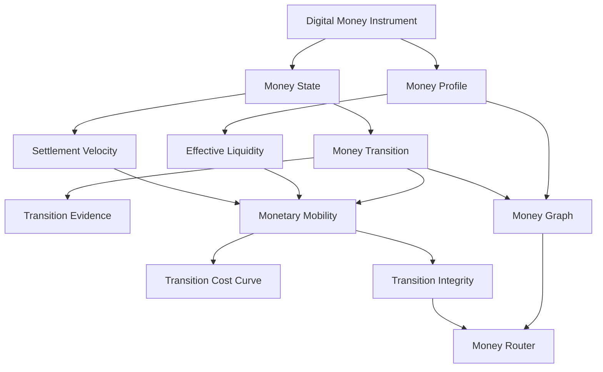

# OMST

## Open Monetary State & Transition Standard

Machine-readable infrastructure for digital-money state, transitions and interoperability.

[Specification](SPECIFICATION.md) [Whitepaper](WHITEPAPER.md) [Schemas](schemas/) [Python](src/omst/) [Conformance](conformance/)

Digital money is becoming programmable, tokenised and fragmented.

The same currency denomination can exist across:

- central-bank settlement systems
- tokenised deposits
- regulated digital money
- public blockchains
- permissioned DLT networks

But these instruments do not necessarily have the same operational properties.

OMST provides open machine-readable primitives for:

- monetary functions
- monetary states
- monetary transitions
- transition evidence
- settlement velocity
- effective liquidity
- monetary mobility
- transition integrity

OMST does not issue, custody or settle money.

It describes how digital money behaves and changes state.

## The Problem

EUR 1 is not always operationally equivalent to EUR 1.

Digital-money instruments can differ in settlement finality, liquidity, redemption, availability, interoperability, access, transferability and operating windows. OMST makes these differences explicit and machine-readable.

## Positioning

OMST is open infrastructure for tokenised monetary systems. It is not a stablecoin, reserve system, proof-of-reserves platform, bridge, payment app, blockchain, token, DAO or compliance product.

The central research question is:

> When digital money moves between monetary instruments, ledgers or settlement environments, what properties are preserved, degraded or transformed?

## Install

```bash
pip install -e .
```

## CLI

```bash
omst validate examples/
omst inspect examples/synthetic-eur-stablecoin/eur-x.json
omst state EUR-X
omst transition --from EUR-X:AVAILABLE --to EUR-Y:FINAL --amount 50000000
omst velocity EUR-X --window 30d
omst liquidity EUR-X
omst mobility --from EUR-X --to EUR-Y --amount 50000000
omst route --from EUR-X --to EUR-Y --amount 50000000 --context tokenized-dvp
omst equivalence EUR-X EUR-Y --context tokenized-dvp
omst simulate redemption-shock
pytest
```

## Flagship Scenario

The v0.1 reference scenario evaluates a synthetic EUR 50m tokenised-bond DvP cash leg. It loads synthetic money profiles, checks state, liquidity, route constraints, transition cost, settlement latency, finality and transition integrity, then rejects incompatible routes.

All public examples are synthetic.

> Synthetic example. Not an issuer assessment. Not a regulatory assessment. Not a representation of actual market conditions.

## Architecture



## API

```python
from omst import MoneyProfile, MoneyState, MoneyTransition
from omst import evaluate_transition, route_money, settlement_velocity

result = evaluate_transition(transition, context)
print(result.status)
print(result.reasons)
```

## Status

v0.2.0 is an experimental reference specification and implementation. Do not call it an industry standard until independent implementations and conformance evidence exist.
