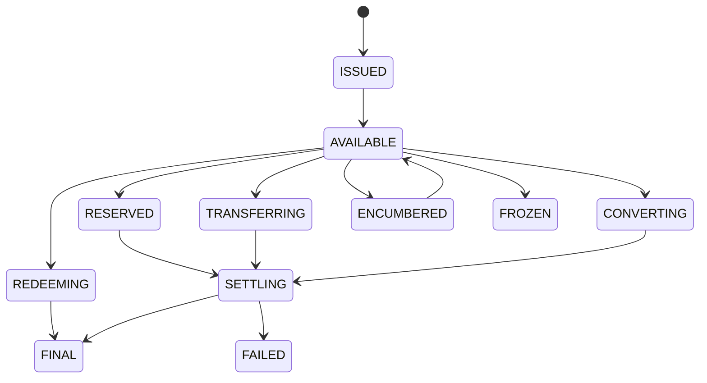

# OMST v0.2 Specification

OMST defines machine-readable primitives for describing, validating, simulating and analysing state transitions of digital money across tokenised financial systems.

v0.2 expands the kernel into an open-standard laboratory: concept chapters, RFCs, language-neutral event envelopes, conformance vectors and typed reference objects.

## Competitive Boundary

Reserve and treasury systems answer what backs an instrument, how reserves are governed, how capital is protected and how reserve evidence is generated. OMST answers what state a monetary instrument is in, what transition is occurring, what changes during that transition, whether required monetary properties are preserved, what evidence supports the transition and what resulting state exists.

OMST can consume reserve evidence in a future adapter, but OMST does not become the reserve system.

## Monetary Classification

`monetary_layer_reference` may use `m0_reference`, `m1_reference`, `m2_reference`, `other`, `unknown`, or `not_applicable`.

M0/M1/M2 are monetary-economic classification concepts. OMST does not establish official monetary aggregates or determine regulatory classification.

Monetary classification is distinct from technical implementation, legal classification and current operational state.

## Primitives

### MoneyProfile

Required fields: `id`, `name`, `currency`, `issuer`, `claim_type`, `monetary_layer_reference`, `functions`, `settlement_profile`, `redemption_profile`, `transfer_profile`, `access_profile`, `control_profile`, `network_profile`, `evidence`.

Optional v0.2 fields include `capabilities` and `version`.

### MoneyCapability

Capabilities are first-class scoped assertions with `capability`, `status`, `conditions`, `scope`, `evidence`, `valid_from` and `valid_until`.

Supported capability names: `PAYMENT`, `SETTLEMENT`, `REDEMPTION`, `TRANSFER`, `CONVERSION`, `COLLATERAL`, `TREASURY`, `CROSS_BORDER`, `PROGRAMMABLE_TRANSFER`, `ATOMIC_SETTLEMENT`, `ESCROW`, `DELIVERY_VERSUS_PAYMENT`, `PAYMENT_VERSUS_PAYMENT`, `INTRADAY_LIQUIDITY`.

### MoneyState

States: `ISSUED`, `AVAILABLE`, `RESERVED`, `LOCKED`, `TRANSFERRING`, `SETTLING`, `FINAL`, `REDEEMING`, `CONVERTING`, `ENCUMBERED`, `FROZEN`, `FAILED`, `UNKNOWN`.



### MoneyTransition

Required fields: `transition_id`, `transition_type`, `source_instrument`, `target_instrument`, `source_state`, `target_state`, `quantity`, `currency`, `initiated_at`, `completed_at`, `settlement_finality`, `liquidity_consumed`, `constraints`, `evidence`.

Lifecycle states preserve the distinction between pending, final, failed, reverted and unknown results.

### Evidence

Evidence source types are `official`, `issuer_declared`, `observed`, `derived`, `simulated`, `community`, and `unknown`. The engine distinguishes `DECLARED`, `OBSERVED`, `DERIVED`, and `SIMULATED` evidence and does not convert declarations into observations.

Evidence chains represent claim, source, observation, transformation and derived-result lineage.

### MoneyEvent

`MoneyEvent` is the canonical event envelope for external systems. Each event includes `omst_schema_version`, `event_id`, `event_type`, `instrument`, `source_state`, `target_state`, `quantity`, `currency`, `timestamp`, `actor_reference`, `ledger_reference`, `transaction_reference` and `evidence`.

### MoneyRelation

`MoneyRelation` represents relationships between monetary instruments, including `REDEEMABLE_FOR`, `CONVERTIBLE_TO`, `SETTLEABLE_AGAINST`, `COLLATERALIZABLE_AGAINST`, `EXCHANGEABLE_FOR`, `BRIDGED_TO`, `MINTED_FROM`, `BACKED_BY` and `SETTLED_IN`.

`BACKED_BY` belongs to the relationship vocabulary, but OMST does not become a reserve-analysis product.

### SettlementContext

Settlement context includes transaction type, amount, currency, asset, venue, deadline, required finality, required liquidity, participants, jurisdiction reference, operating window and settlement mode.

### TransitionRequirement And TransitionEvaluation

`TransitionRequirement` states what the transaction requires. `TransitionEvaluation` returns `COMPATIBLE`, `INCOMPATIBLE`, `CONDITIONAL` or `UNKNOWN` with explicit reasons such as finality mismatch, liquidity insufficient, operating-window mismatch, capability unavailable, conversion route unavailable or evidence insufficient.

### Monetary Equivalence

Monetary equivalence distinguishes nominal, functional, settlement, economic and contextual equivalence. Same currency does not necessarily mean same settlement capability.

### MonetaryTransitionIntegrity

State vector:

```text
S = (F,R,L,A,T,I,C)
```

where finality, redemption, liquidity, availability, transferability, institutional eligibility/access and control constraints are compared dimension-by-dimension. Results are `PRESERVED`, `DEGRADED`, `IMPROVED`, `INCOMPARABLE`, or `UNKNOWN`.
