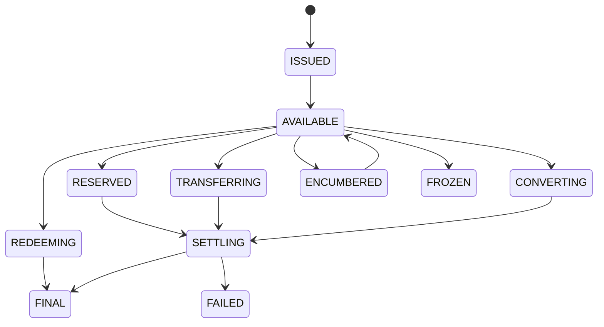

# OMST v0.1 Specification

OMST defines machine-readable primitives for describing, validating, simulating and analysing state transitions of digital money across tokenised financial systems.

## Competitive Boundary

Reserve and treasury systems answer what backs an instrument, how reserves are governed, how capital is protected and how reserve evidence is generated. OMST answers what state a monetary instrument is in, what transition is occurring, what changes during that transition, whether required monetary properties are preserved, what evidence supports the transition and what resulting state exists.

OMST can consume reserve evidence in a future adapter, but OMST does not become the reserve system.

## Monetary Classification

`monetary_layer_reference` may use `m0_reference`, `m1_reference`, `m2_reference`, `other`, `unknown`, or `not_applicable`.

M0/M1/M2 are monetary-economic classification concepts. OMST does not establish official monetary aggregates or determine regulatory classification.

Monetary classification is distinct from technical implementation, legal classification and current operational state.

## Primitives

### MoneyProfile

Required fields: `id`, `name`, `currency`, `issuer`, `claim_type`, `monetary_layer_reference`, `functions`, `settlement_profile`, `redemption_profile`, `transfer_profile`, `access_profile`, `control_profile`, `network_profile`, `evidence`.

### MoneyState

States: `ISSUED`, `AVAILABLE`, `RESERVED`, `LOCKED`, `TRANSFERRING`, `SETTLING`, `FINAL`, `REDEEMING`, `CONVERTING`, `ENCUMBERED`, `FROZEN`, `FAILED`, `UNKNOWN`.



### MoneyTransition

Required fields: `transition_id`, `transition_type`, `source_instrument`, `target_instrument`, `source_state`, `target_state`, `quantity`, `currency`, `initiated_at`, `completed_at`, `settlement_finality`, `liquidity_consumed`, `constraints`, `evidence`.

Lifecycle states preserve the distinction between pending, final, failed, reverted and unknown results.

### Evidence

Evidence source types are `official`, `issuer_declared`, `observed`, `derived`, `simulated`, `community`, and `unknown`. The engine distinguishes `DECLARED`, `OBSERVED`, `DERIVED`, and `SIMULATED` evidence and does not convert declarations into observations.

### MonetaryTransitionIntegrity

State vector:

```text
S = (F,R,L,A,T,I,C)
```

where finality, redemption, liquidity, availability, transferability, institutional eligibility/access and control constraints are compared dimension-by-dimension. Results are `PRESERVED`, `DEGRADED`, `IMPROVED`, `INCOMPARABLE`, or `UNKNOWN`.
