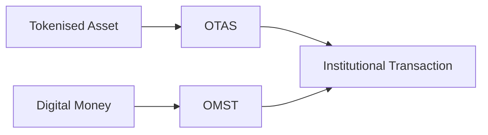

# OTAS Relationship

OTAS can describe the capabilities of the asset being settled. OMST can describe the state and transition properties of the monetary leg. This repository does not claim affiliation or formal compatibility.
